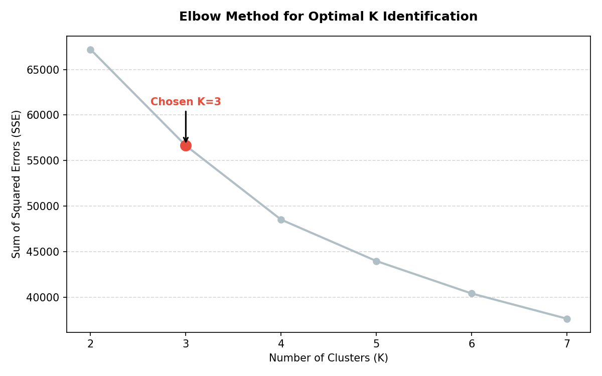
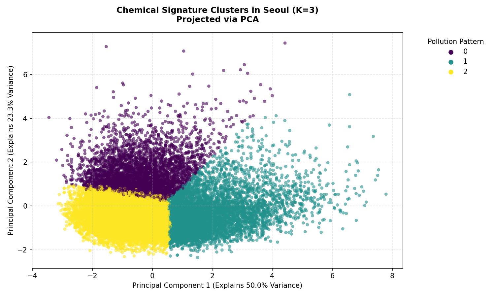
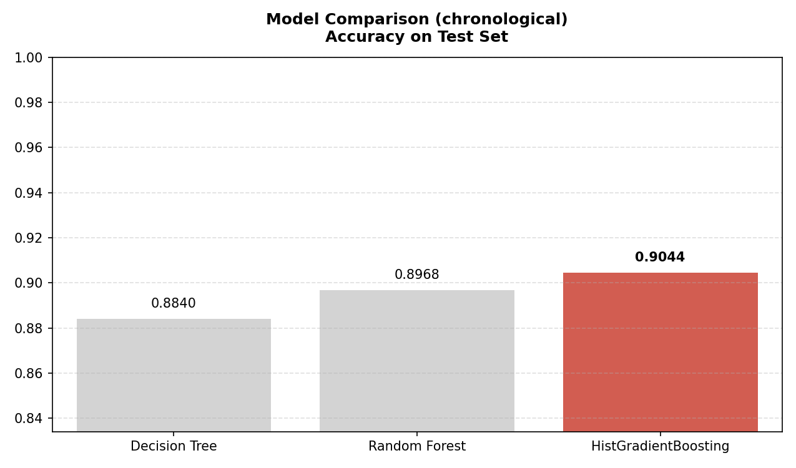
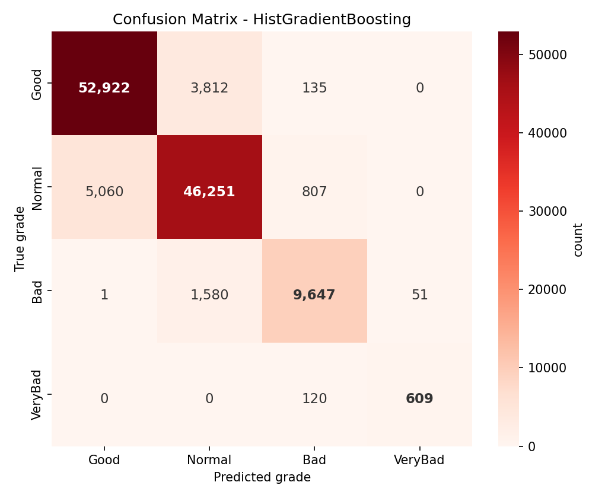

# Seoul Air Quality: Pollution Pattern Mining & PM2.5 Grade Prediction


An end-to-end machine learning study on hourly air-quality measurements from
25 monitoring stations in Seoul (2017-2019, ~650k rows): unsupervised mining of
co-pollution "chemical signatures" plus supervised PM2.5 health-grade warning,
framed as a public-health early-warning problem where **missed extreme
pollution events cost more than false alarms**.

Originally a graduate course final project (Machine Learning, City University of
Macau, Spring 2026, graded team submission); this repository is the revised,
reproducible version described in [Corrections](#corrections-from-the-graded-course-version).

## Pipeline

```
raw CSVs (summary + station meta + instrument log)
  -> cleaning          drop rows with any non-normal instrument status, -1 sensor sentinels, NaNs
  -> features          hour / day-of-week / month, district one-hot, 1-h lag (PM2.5, PM10),
                       6-h rolling mean of PREVIOUS hours (leakage-free)
  -> target            PM2.5 grade: Good <=15 < Normal <=35 < Bad <=75 < VeryBad  (ug/m3)
  -> splits            PRIMARY: chronological 80/20 (train <= 2019-05-19)
                       comparison: random stratified 80/20
  -> descriptive       K-Means (K=3, elbow on 20k sample) + PCA projection
  -> predictive        Decision Tree / Random Forest / HistGradientBoosting
  -> evaluation        accuracy, macro-F1, per-class report, confusion matrices,
                       dangerous-false-negative count for the VeryBad class
```

## Results

Models share identical splits, scalers (fit on train only) and random seeds.

**Primary protocol - chronological split** (test = last 20% of the timeline,
May-Dec 2019; VeryBad = 0.6% of test rows):

| Model | Accuracy | Macro-F1 | VeryBad recall | Missed VeryBad (FN) |
|---|---|---|---|---|
| Decision Tree | 0.8840 | 0.8706 | 0.809 | 139 / 729 |
| Random Forest | 0.8968 | 0.8739 | 0.757 | 177 / 729 |
| **HistGradientBoosting** | **0.9044** | **0.8919** | **0.835** | **120 / 729** |

**Comparison protocol - random stratified split** (the original course protocol;
optimistic because neighbouring hours leak across train/test):

| Model | Accuracy | Macro-F1 | VeryBad recall | Missed VeryBad (FN) |
|---|---|---|---|---|
| Decision Tree | 0.8681 | 0.8651 | 0.844 | 463 / 2,976 |
| Random Forest | 0.8805 | 0.8750 | 0.830 | 505 / 2,976 |
| **HistGradientBoosting** | **0.8871** | **0.8863** | **0.882** | **352 / 2,976** |

HistGradientBoosting wins under both protocols: boosting sequentially corrects
the residual errors on rare, extreme episodes, which is exactly where a
warning system must not fail.

### Clustering: three chemical signatures

K-Means on the five standardized pollutants **excluding PM2.5** (kept out so the
descriptive task does not circularize the predictive target). Elbow at K=3;
PCA (PC1 50.0%, PC2 23.3%) shows one dense baseline cloud and two extreme
long-tail regimes:

| Cluster | Share | Signature (z-scores) | Reading |
|---|---|---|---|
| 2 | 52.6% | all pollutants below mean | clean baseline air |
| 1 | 27.7% | NO2 +1.2, CO +1.1, low O3 | traffic / combustion episodes |
| 0 | 19.6% | O3 +1.3, high SO2 & PM10 | photochemical / secondary-pollution events |

## Figures

| Elbow (K selection) | PCA projection of clusters |
|---|---|
|  |  |

| Model accuracy (chronological) | Best model confusion matrix |
|---|---|
|  |  |

## Getting started

1. `pip install -r requirements.txt`
2. Download the *Seoul Air Quality* dataset (Kaggle: "Air Pollution Seoul",
   hourly means, 25 stations, 2017-2019) and place the CSVs as:

```
AirPollutionSeoul/
├── Measurement_summary.csv
└── Original Data/
    ├── Measurement_info.csv
    └── Measurement_station_info.csv
```

3. Run:

```bash
python main.py                 # uses ./AirPollutionSeoul
python main.py --data /path/to/AirPollutionSeoul
```

Runtime ~1 min on a laptop CPU. Outputs: console log
(`results/run_log.txt` via redirection), metrics JSON
(`results/classification_results.json`), cluster profile CSV, and all figures
in `figures/`. Individual stages: `python data_preprocessing.py`,
`python task_clustering.py`, `python task_classification.py`.
`render_cm.py` re-draws confusion heatmaps from the JSON without retraining.

## Corrections from the graded course version

The submitted course version reported 88.54% accuracy under a random split.
While preparing this repository I found and fixed four methodological issues;
all numbers above are from the corrected pipeline:

1. **Label leakage in `PM2.5_roll6`** - the rolling mean included the *current*
   hour, i.e. the very value the target grade is derived from. Now computed on
   the six *previous* hours only (`shift(1)` before `rolling`).
2. **Random split on time-series data** - neighbouring hours leaked between
   train and test. The primary protocol is now a chronological 80/20 split;
   the random split is kept as an explicit comparison.
3. **Unused instrument-status filter** - the course code loaded
   `Measurement_info.csv` but never applied it; rows where any sensor reported
   a non-normal status (6.6% of the data) are now actually dropped.
4. **Warm-up ordering** - lag/rolling features are now computed after an
   explicit sort by (station, timestamp).

## Limitations

- Single-cut validation; a rolling-origin evaluation would be stronger.
- No meteorological covariates (wind, temperature) - the biggest known driver
  of dispersion; see the report's future-work section.
- K-Means assumes convex clusters; the long-tail regimes suggest GMM or
  HDBSCAN as follow-ups.
- Class-3 thresholds are fixed banding; cost-sensitive tuning of the decision
  threshold (precision/recall trade-off) is left to future work.

## Team

Two-person course team: one member contributed the visualization scheme, model
pipeline and report; the other the experimental analysis and framework.
Personal student IDs and the graded report PDF are intentionally not published
here.
